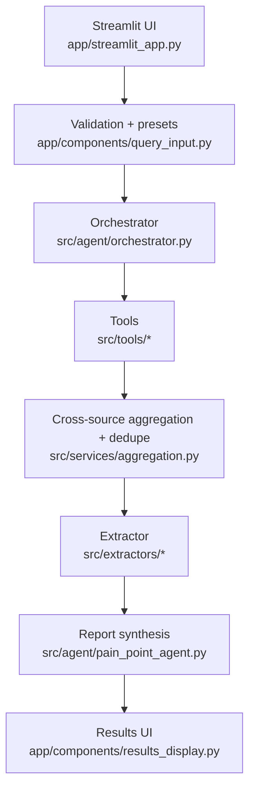

# Customer Pain Point Agent – Architecture Overview

This document explains the end-to-end flow of the app, the major components, and the core technologies used to build the system.

## High-level flow

## What happens when a user clicks “Analyze”

1. **UI collects input**
   - The Streamlit app renders presets + query input components.
   - The query is validated (length + basic sanity checks) before execution.

2. **Orchestrator coordinates the run**
   - The orchestrator builds the agent/tool chain and emits progress events.
   - The Streamlit UI consumes progress events and renders the “Research Progress” panel.

3. **Tools fetch raw source data**
   - Reddit via PRAW (`src/tools/reddit_tool.py`)
   - Google Search via Google API client (`src/tools/google_search_tool.py`)
   - Tools are feature-flagged via env vars so production can disable providers cleanly.

4. **Aggregation merges and ranks**
   - Multi-source payloads are normalized and near-duplicates are merged.
   - Items carry provenance metadata so downstream extraction can cite sources.

5. **Extraction produces structured pain points**
   - The extractor converts the aggregated corpus into structured JSON.
   - Output is validated/normalized to keep it JSON-serializable and UI-friendly.

6. **UI renders results**
   - Summary metrics (sources searched, execution time) plus the analyst report and pain points.

## Key technologies and why they’re used

- **Streamlit**: fast iteration for internal tools and dashboards; simple deploy story on Streamlit Community Cloud.
- **LangChain**: orchestration primitives for tool calls and LLM execution.
- **OpenAI API** (via `openai` + `langchain-openai`): converts unstructured text into structured pain point outputs.
- **PRAW**: stable Reddit integration.
- **Google API Python Client**: Custom Search API integration.
- **Pydantic**: strict validation and predictable output shapes.

## Code map (entry points)

- UI entry point: `app/streamlit_app.py`
- Orchestration: `src/agent/orchestrator.py`
- Agent runner: `src/agent/pain_point_agent.py`
- Tools: `src/tools/`
- Aggregation: `src/services/aggregation.py`
- Extractors: `src/extractors/`

## Operational notes

- Secrets are injected via environment variables (or Streamlit secrets on Community Cloud).
- Docker deployments rely on `Dockerfile` + `scripts/healthcheck.py` and the GitHub Actions workflow in `.github/workflows/deploy.yml`.
