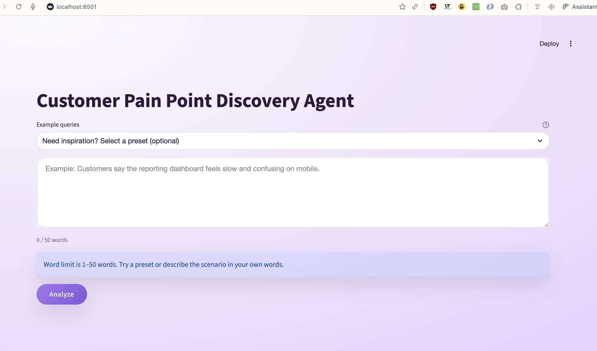

# User Guide – Customer Pain Point Discovery Agent

This app helps you research and summarize recurring customer pain points by searching sources (e.g., Reddit and Google Search), deduplicating results, and generating an analyst-style report with citations.

## What you need
- Access to the deployed app URL (or a local run).
- If you run locally, API keys in `.env` (see `docs/setup.md`).

## Quickstart

1. Open the app.
2. (Optional) Pick an example query preset.
3. Enter a short query describing the customer segment and product/context.
   - Example: `customers struggling with onboarding to analytics dashboards`
4. Click **Analyze**.
5. Watch **Research Progress** as the agent plans, searches sources, dedupes, extracts pain points, and writes the report.
6. Review:
   - **Summary** metrics (sources searched, execution time)
   - **Analyst Report**
   - Pain points list with citations

## Interpreting the results

### Summary metrics
- **Sources Searched**: total results collected across enabled sources.
- **Execution Time**: end-to-end time for the run.

### Analyst report
The report is a synthesized narrative. Validate key claims using citations and the source list.

### Pain points
Pain points are extracted from the aggregated corpus and presented as short descriptions with examples and citations. Use them as hypotheses for customer interviews or roadmap planning.

## Usage tips
- Be specific about the persona and context (e.g., “B2B SaaS admins”, “first-time analysts”, “SMB accounting teams”).
- Include the product category if it matters (“customer onboarding”, “analytics dashboards”, “KYC flows”).
- If results are noisy, narrow the query or disable a provider you don’t want (see “Known limitations”).

## Known limitations
- Outputs depend on available sources and upstream provider rate limits.
- Google Search can be disabled via `TOOL_GOOGLE_SEARCH_ENABLED=false` for deployments that only use Reddit.
- Some citations may be missing when a provider returns incomplete metadata.

## Privacy and safety
- Do not paste real customer PII into queries.
- Never paste API keys into the query field.

## Screenshots (UI reference)
These reference images help orient you to the layout and where to find results.

## Troubleshooting
- If a run fails, retry the query (providers can rate-limit).
- If the app shows missing secrets, confirm deployment secrets are configured.

## Further reading
- Local setup: `docs/setup.md`
- Deployment runbook: `docs/deployment/production-deployment.md`
- Streamlit Community Cloud steps: `docs/deployment/streamlit-community-cloud.md`
